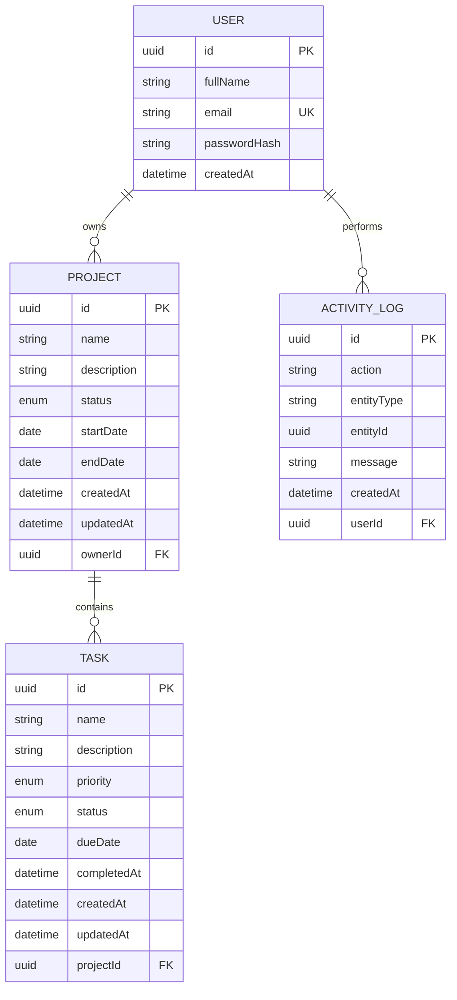

# Database ER Diagram

```mermaid
erDiagram
    USER ||--o{ PROJECT : owns
    USER ||--o{ ACTIVITY_LOG : performs
    PROJECT ||--o{ TASK : contains

    USER {
        uuid id PK
        string fullName
        string email UK
        string passwordHash
        datetime createdAt
    }
    PROJECT {
        uuid id PK
        string name
        string description
        enum status
        date startDate
        date endDate
        datetime createdAt
        datetime updatedAt
        uuid ownerId FK
    }
    TASK {
        uuid id PK
        string name
        string description
        enum priority
        enum status
        date dueDate
        datetime completedAt
        datetime createdAt
        datetime updatedAt
        uuid projectId FK
    }
    ACTIVITY_LOG {
        uuid id PK
        string action
        string entityType
        uuid entityId
        string message
        datetime createdAt
        uuid userId FK
    }
```
